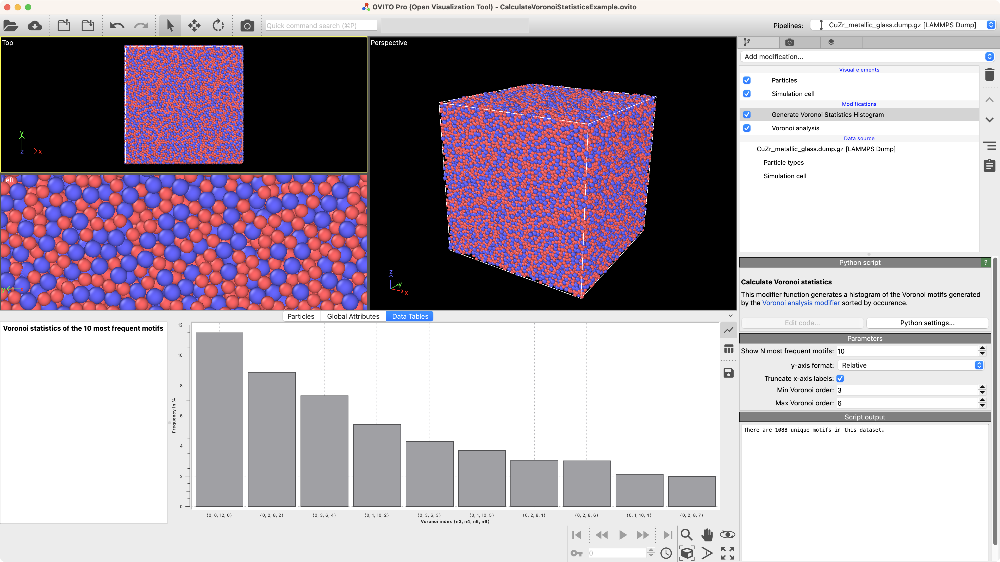

# Calculate Voronoi statistics
This *OVITO* [Python modifier](https://docs.ovito.org/python/introduction/custom_modifiers.html) generates a histogram of the Voronoi motifs generated by the 
[Voronoi analysis modifier](https://www.ovito.org/docs/current/reference/pipelines/modifiers/voronoi_analysis.html) 
sorted by occurence.

## Description
...

## Parameters 
- `max_indices` / "Show N most frequent motifs": 
- `y_axis_format` / "y-axis format: Absolute / Relative":
- `x_axis_labels` / "Truncate x-axis labels": Lets you choose wheter to shorten the Voronoi indices in the x-axis labels. If disabled labels will be `<n_1, n_2, ...,n_max-face-order>`
- `n_start` / "Min Voronoi order": The start Voronoi index used in x-axis labels (only if option `Truncate x-axis labels` is selected.) `<n_start,...,n_end>`
- `n_end` / "Max Voronoi order": The end Voronoi index used in x-axis labels (only if option `Truncate x-axis labels` is selected.) `<n_start,...,n_end>`

## Example


## Installation
- OVITO Pro built-in Python interpreter
```
ovitos -m pip install --user git+https://github.com/ckalcher/CalculateVoronoiStatistics.git
``` 
- Standalone Python package or Conda environment
```
pip install --user git+https://github.com/ckalcher//CalculateVoronoiStatistics.git
```
- Please note that the `--user` tag is recommended but optional and depends on your Python installation.

## Technical information / dependencies
- Tested on OVITO version 3.9.1

## Contact
Constanze Kalcher kalcher@ovito.org
